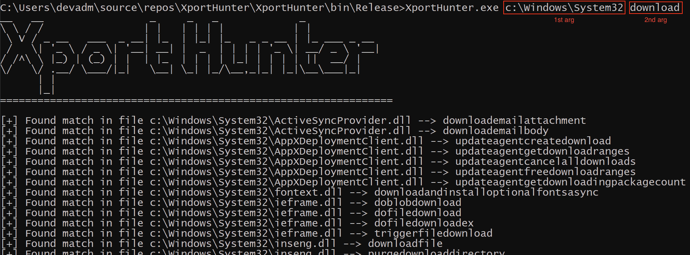

# XportHunter
Simple utility to find exported functions in PE files based on a search term

## A bit more info
I use this to take a directory with a bunch of exe/dll/both files and rapidly check each one for any exported functions that might contain a string in their name. Code is super basic and instead of parsing the PE files exports by hand, this is relying on PeNet so make sure to install that first via NuGet package manager in Visual Studio. The most recent version as of this repo creation is v3.

## How to use
This takes 2 arguments. First is the full path to the directory you wish to hunt in and the second is the search term you want to find. Write your search term lowercase since the tool will do that against all matches anyways. 

## Misc
There isn't any error handling for the cmdline arguments so feel free to fork and make this work better for you.

## Screenshots

